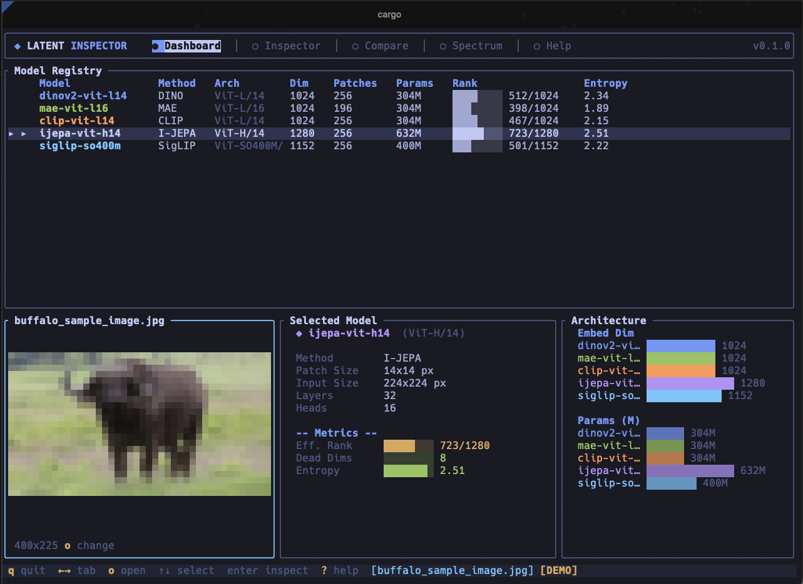
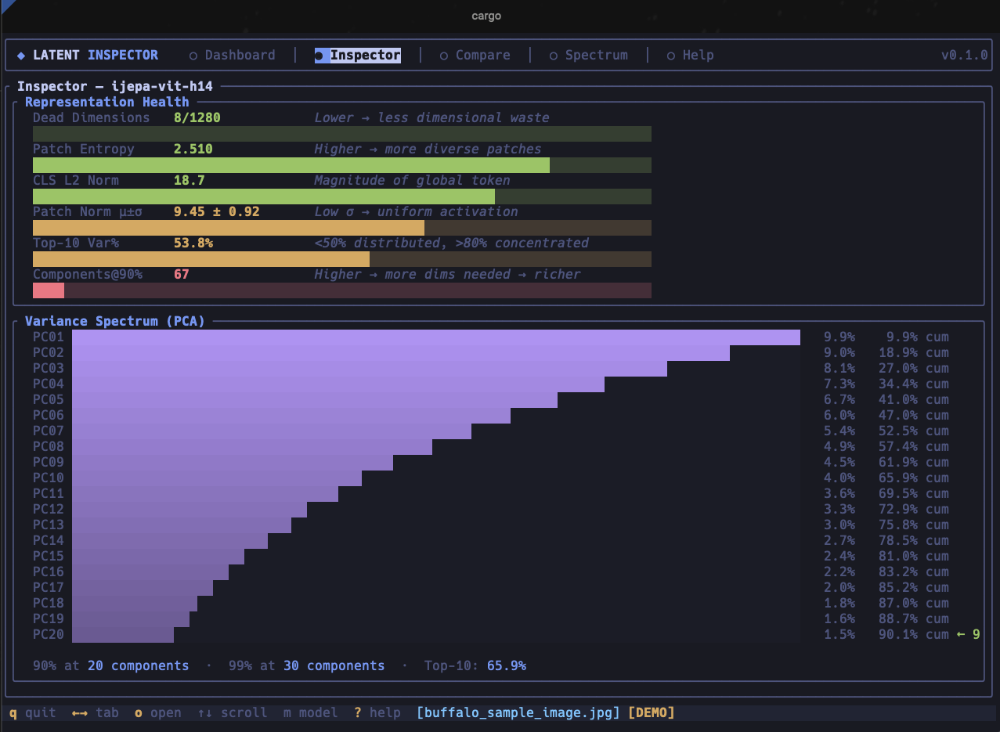
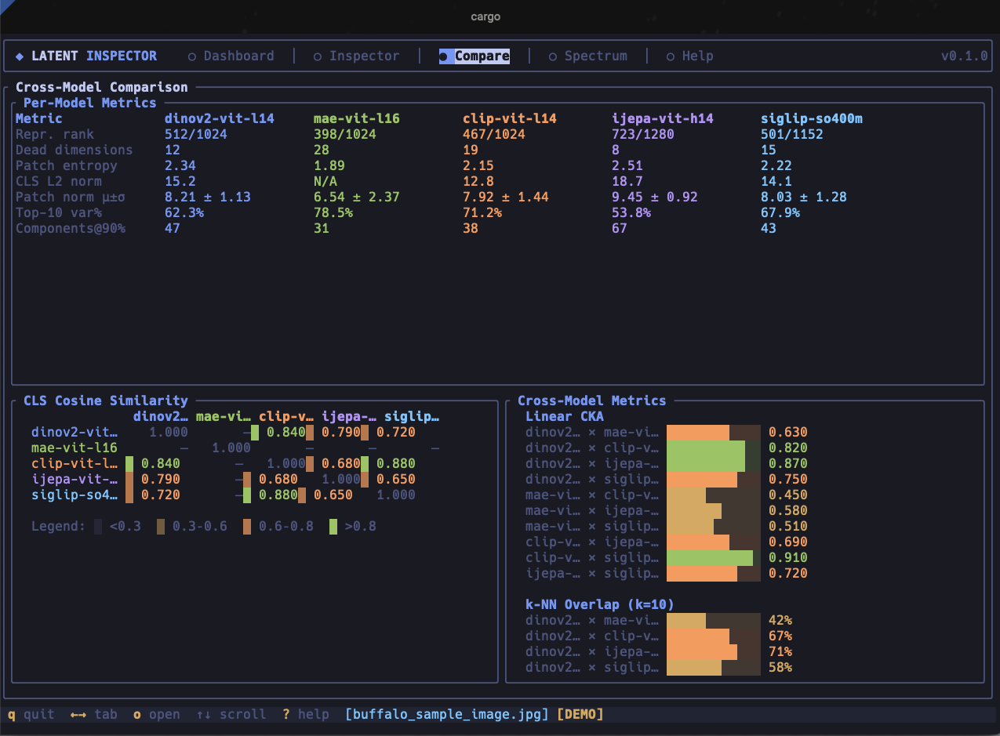
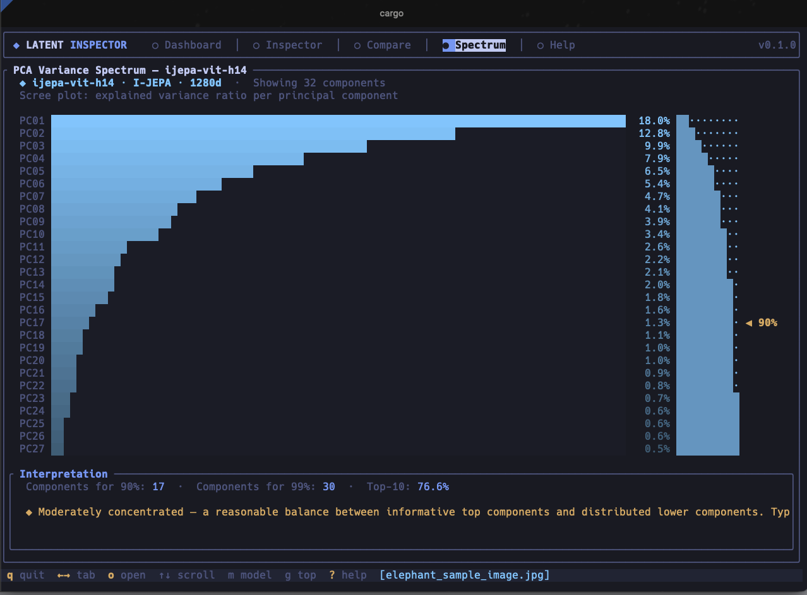
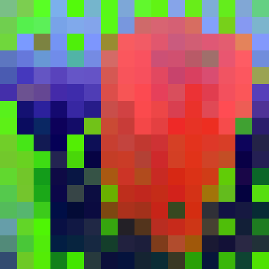
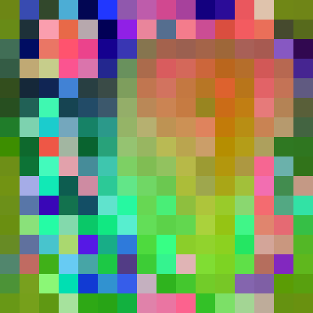
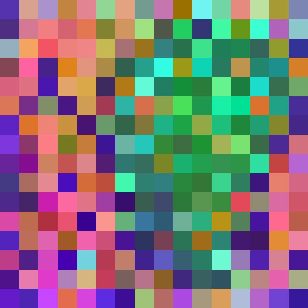
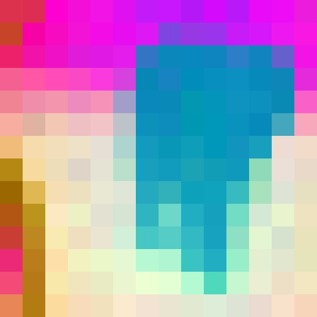

<div align="center">

# latent-inspector

Inspect and compare self-supervised vision model representations for DINOv2, I-JEPA, V-JEPA 2, EUPE.

[](https://crates.io/crates/latent-inspector)
[](https://crates.io/crates/latent-inspector)
[](https://www.rust-lang.org)

</div>
<table>
<tr>
<td width="50%"><br/><sub>Dashboard -- model registry, image preview, architecture comparison</sub></td>
<td width="50%"><br/><sub>Inspector -- representation health gauges and PCA variance spectrum</sub></td>
</tr>
<tr>
<td width="50%"><br/><sub>Compare -- cross-model metrics, CLS similarity matrix, CKA and k-NN overlap</sub></td>
<td width="50%"><br/><sub>Spectrum -- full PCA scree plot with 90%/99% thresholds</sub></td>
</tr>
</table>

## PCA projections across models

Each pixel block below is a patch token projected onto the top three principal components (mapped to RGB). Contiguous color = the model groups those patches into a similar representation neighborhood. Same image, same patches, four different answers about what matters.

<table>
<tr>
<td width="50%"><br/><sub><strong>DINOv2</strong> -- large uniform regions. Self-distillation pushes semantically related patches together, so the model produces something close to unsupervised segmentation. Elephant = one color, background = another.</sub></td>
<td width="50%"><br/><sub><strong>I-JEPA</strong> -- finer local variation. The latent-prediction objective forces each patch to encode its own context rather than collapsing into broad semantic zones.</sub></td>
</tr>
<tr>
<td width="50%"><br/><sub><strong>V-JEPA 2</strong> -- structured regions with less static partitioning. Trained on video, so even on a still image the encoder organizes patches as if they could move.</sub></td>
<td width="50%"><br/><sub><strong>EUPE</strong> -- compressed, high-contrast boundaries. Multi-teacher distillation produces a compact representation that prioritizes hard task-relevant separations over smooth gradients.</sub></td>
</tr>
</table>

<details>


## Quick start

```bash
git clone https://github.com/AbdelStark/latent-inspector.git
cd latent-inspector
cargo build --release

# List models and cache state
./target/release/latent-inspector models

# Compare three models on a single image (models auto-download on first use)
./target/release/latent-inspector compare photo.jpg \
  --models dinov2-vit-l14,ijepa-vit-h14,vjepa2-vitl-fpc2-256

# Deep-dive into one model
./target/release/latent-inspector inspect photo.jpg --model dinov2-vit-l14

# Interactive TUI (real analysis when an image is provided)
./target/release/latent-inspector tui photo.jpg -m dinov2-vit-l14,ijepa-vit-h14

# Profile a model over a dataset (isotropy, uniformity, intrinsic dimensionality)
./target/release/latent-inspector profile --model dinov2-vit-l14 --dataset images/

# Stub backend for development (no model downloads, validation downgraded to unverified)
LATENT_INSPECTOR_MODEL_BACKEND=stub \
  ./target/release/latent-inspector compare photo.jpg \
  --models dinov2-vit-l14,clip-vit-l14
```

## Why this exists

Different SSL objectives produce different internal representations of the same image. You can read the papers and get intuitions about what should differ. But intuitions are wrong often enough that you should measure.

- **DINOv2** -- self-distillation across augmented views. Patches in similar semantic regions get pushed together. The result looks like unsupervised segmentation.
- **I-JEPA** -- predict masked patches in latent space (not pixel space). Each patch must encode enough context to reconstruct its neighbors abstractly. Higher patch entropy than DINOv2 because the objective demands it.
- **V-JEPA 2** -- JEPA on video. Learns spatiotemporal structure from internet-scale video. Even on a still image, the encoder carries a prior about how the world moves.
- **EUPE** -- distill DINOv2 + depth estimators + segmenters into one small encoder. The representation is a learned compromise across tasks.
- **MAE** -- reconstruct masked pixels. Must encode enough detail to literally redraw what was hidden.
- **CLIP** -- align images with text. The representation is shaped by language, not just visual similarity.

latent-inspector makes these differences concrete. Numbers, not vibes.

## Supported models

| Model | Architecture | Params | Method | Status |
|-------|-------------|--------|--------|--------|
| **DINOv2** | ViT-L/14 | 304M | Self-distillation + centering | **Ready** |
| **I-JEPA** | ViT-H/14 | 632M | Joint embedding predictive | **Ready** |
| **V-JEPA 2** | ViT-L/16 | 304M | Video joint embedding predictive | **Ready** |
| **EUPE** | ViT-B/16 | 86M | Multi-teacher distillation | **Ready** |
| DINOv3 | ViT-L/14 | 304M | Self-distillation + Gram anchoring | Planned |
| MAE | ViT-L/16 | 304M | Masked autoencoder | Planned |
| CLIP | ViT-L/14 | 304M | Contrastive image-text | Planned |
| SigLIP | ViT-SO400M/14 | 400M | Sigmoid contrastive image-text | Planned |

Models download on first use (~1-2 GB each) and are SHA-256 verified. Downloads retry on transient HTTP failures. Override cache location with `LATENT_INSPECTOR_CACHE_DIR`.

<summary><strong>Model provenance and ONNX artifacts</strong></summary>

Everything runs through ONNX Runtime. Sources:

| CLI name | Original checkpoint | ONNX source | Paper |
|----------|-------------------|-------------|-------|
| `dinov2-vit-l14` | [`facebook/dinov2-large`](https://huggingface.co/facebook/dinov2-large) | [`onnx-community/dinov2-large`](https://huggingface.co/onnx-community/dinov2-large) -- community export | [Oquab et al. 2024](https://arxiv.org/abs/2304.07193) |
| `ijepa-vit-h14` | [`facebook/ijepa_vith14_1k`](https://huggingface.co/facebook/ijepa_vith14_1k) | [`onnx-community/ijepa_vith14_1k`](https://huggingface.co/onnx-community/ijepa_vith14_1k) -- community export | [Assran et al. 2023](https://arxiv.org/abs/2301.08243) |
| `vjepa2-vitl-fpc2-256` | [`facebook/vjepa2-vitl-fpc64-256`](https://huggingface.co/facebook/vjepa2-vitl-fpc64-256) | [`abdelstark/vjepa2-vitl-fpc2-256-onnx`](https://huggingface.co/abdelstark/vjepa2-vitl-fpc2-256-onnx) -- custom export | [Bardes et al. 2024](https://arxiv.org/abs/2506.09985) |
| `eupe-vit-b16` | [`facebook/EUPE-ViT-B`](https://huggingface.co/facebook/EUPE-ViT-B) | [`abdelstark/eupe-vit-b16-onnx`](https://huggingface.co/abdelstark/eupe-vit-b16-onnx) -- custom export | [Zhu et al. 2026](https://arxiv.org/abs/2603.22387) |

**V-JEPA 2 export notes.** V-JEPA 2 is a video model. Since we analyze single images, we exported only the encoder (no predictor head) with a fixed 2-frame input -- the image is duplicated to meet the `tubelet_size=2` requirement. Output: 256 spatial patch tokens at dim 1024, same shape as DINOv2, so cross-model comparison works directly. Exported via TorchScript at opset 14, simplified with [onnxsim](https://github.com/daquexian/onnx-simplifier), verified against PyTorch reference (max diff < 0.003). Artifact: [`abdelstark/vjepa2-vitl-fpc2-256-onnx`](https://huggingface.co/abdelstark/vjepa2-vitl-fpc2-256-onnx).

**EUPE export notes.** EUPE's `forward_features()` returns CLS and patch tokens as separate dict entries. We wrapped it to concatenate into `[1, 197, 768]` (CLS at index 0). RoPE positions were cast from BFloat16 to Float32 for ONNX compatibility. Opset 14 + onnxsim, 834 nodes, max diff 0.0003 vs PyTorch. Artifact: [`abdelstark/eupe-vit-b16-onnx`](https://huggingface.co/abdelstark/eupe-vit-b16-onnx).

For other HuggingFace models, use the [ONNX Community Converter](https://huggingface.co/spaces/onnx-community/convert-to-onnx).

</details>

---

## Case study: how DINOv2 and I-JEPA see an elephant

A real example. Same elephant photograph, two models, different training objectives. 
### Compare both models

```bash
latent-inspector compare docs/assets/img/samples/elephant_sample_image.jpg \
  --models dinov2-vit-l14,ijepa-vit-h14
```

```
Model Comparison
================================================================================
Metric                dinov2-vit-l14  ijepa-vit-h14
--------------------------------------------------------------------------------
Repr. rank            60/1024         44/1280
Dead dimensions       0               0
Patch entropy         2.52            2.89
CLS L2 norm           46.3            N/A
Top-10 var%           66.8%           72.7%
Components@90%        31              22
Patch isotropy        0.712           0.834
Patch uniformity      -2.891          -3.247
================================================================================
```

<details>
<summary><strong>Reading these numbers</strong></summary>

**Representation rank** (60 vs 44). How many dimensions the model actually uses. DINOv2 spreads across 60 effective dimensions out of 1024. I-JEPA uses 44 out of 1280. Zero dead dimensions in both -- no wasted capacity, just different concentrations.

**Patch entropy** (2.52 vs 2.89). How differentiated the patch representations are. I-JEPA's prediction objective forces fine-grained spatial encoding, so each patch carries more unique information. DINOv2's self-distillation favors globally consistent features -- patches on the same object tend to look alike.

**CLS L2 norm** (46.3 vs N/A). DINOv2 has a CLS token (one vector summarizing the whole image). I-JEPA doesn't -- it was never designed with one. The tool reports `N/A` rather than silently dropping the metric.

**Top-10 variance / Components@90%**. I-JEPA packs 72.7% of variance into 10 components and needs only 22 for 90%. DINOv2 is more spread (66.8% / 31). I-JEPA's representation is lower-dimensional in practice despite having a wider embedding space. Worth thinking about if you're choosing a backbone for a downstream task with limited data.

**Isotropy** (0.712 vs 0.834). How directionally diverse the patch embeddings are (1 = perfectly isotropic, 0 = all patches point the same way). I-JEPA patches are more directionally diverse -- each patch represents something more distinct.

**Uniformity** (-2.891 vs -3.247). Wang & Isola (2020) metric for how evenly patches spread on the unit hypersphere. More negative = better spread. I-JEPA distributes patches more uniformly, consistent with its latent-prediction objective that naturally prevents representational collapse.

</details>

### Cross-model similarity

```
Linear CKA:     0.329    (representation geometry overlap)
k-NN overlap:   0.278    (fraction of shared nearest neighbors)
```

CKA of 0.329 means some structural overlap but substantially different organization. k-NN overlap of 27.8% means when DINOv2 considers two patches "similar," I-JEPA often disagrees. The trunk patches might cluster with body patches in one model but with boundary patches in the other.

These are genuinely different representations of the same image. Not just rotations of each other. Different training objectives, different geometry.

### Summary

| Property | DINOv2 | I-JEPA | What it means |
|----------|--------|--------|---------------|
| Effective rank | 60/1024 | 44/1280 | DINOv2 uses more dimensions |
| Variance concentration | 66.8% in top 10 | 72.7% in top 10 | I-JEPA is more concentrated |
| Patch entropy | 2.52 | 2.89 | I-JEPA differentiates patches more |
| Patch isotropy | 0.712 | 0.834 | I-JEPA spreads more uniformly |
| CLS token | Yes (46.3 norm) | No | Different architectures |
| CKA | -- | 0.329 | Different internal geometry |

---

<details>
<summary><h2>Commands reference</h2></summary>

### `compare` -- side-by-side model comparison

```bash
latent-inspector compare <image> --models <model1>,<model2>[,...]
  [--format terminal|json|html|png] [--output <dir>] [--pca-components <n>]
```

Per-model metrics plus pairwise cross-model similarity. Handles mismatched architectures: dimension-agnostic metrics (CKA, k-NN) work when patch counts match; dimension-dependent and CLS-dependent metrics report `N/A` with an explanation.

### `inspect` -- single model deep-dive

```bash
latent-inspector inspect <image> --model <model>
  [--format terminal|json|html|png] [--output <dir>] [--pca-components <n>]
```

Full representation analysis: rank, entropy, variance spectrum, patch norm statistics, isotropy, uniformity, spatial coherence, attention concentration (when available), and PCA projection. PNG/HTML output includes a spatial coherence heatmap.

### `neighbors` -- k-NN retrieval across a dataset

```bash
latent-inspector neighbors <image> --model <model> --dataset <dir>
  [--k <n>] [--format terminal|json|html|png] [--output <dir>]
```

Find the k most similar images according to the model. Shows what a model considers "similar." Falls back to mean-patch embeddings when no CLS token is available.

### `similarity` -- cross-model alignment on a dataset

```bash
latent-inspector similarity --model-a <model> --model-b <model> --dataset <dir>
  [--format terminal|json|html|png] [--output <dir>]
```

Dataset-level CKA, k-NN overlap, and (when both models expose CLS) mean CLS cosine similarity. Parallel inference across the dataset.

### `profile` -- representation space profiling

```bash
latent-inspector profile --model <model> --dataset <dir>
  [--format terminal|json|html|png] [--output <dir>]
```

Dataset-level representation fingerprint: isotropy (cosine + partition function), uniformity (Wang & Isola 2020), intrinsic dimensionality (Levina & Bickel 2004 MLE), plus per-image metric aggregates.

### `drift` -- track representation changes across checkpoints

```bash
latent-inspector drift --model <model> --checkpoints <dir> --dataset <dir>
  [--format terminal|json|html|png] [--output <dir>]
```

Load `.onnx` checkpoints from different training stages, compute consecutive CKA. Shows when representations materially shift during training. Natural numeric ordering (`step-2.onnx` before `step-10.onnx`).

### `embed` -- export embeddings as JSON Lines

```bash
latent-inspector embed <image-or-dir> --model <model>
  [--level global|patches|full] [--output <file.jsonl>]
```

Export model embeddings for downstream use (Python, JS, etc). Outputs one JSON object per line (JSONL). Three levels: `global` (CLS/mean-patch vector), `patches` (full patch matrix), `full` (both). Writes to stdout by default; use `--output` for file output. Handles single images and directories (recursive scan).

### `models` -- registry and cache status

```bash
latent-inspector models [--verbose] [--download <model>]
  [--format terminal|json|html] [--output <dir>]
```

Model registry with status, readiness, cache state, evidence status, artifact inventory. Use `--download <model>` to pre-cache.

### `validate` -- preprocessing and parity checks

```bash
latent-inspector validate --model <model>
  [--format terminal|json|html] [--output <dir>] [--refresh-goldens]
```

Validates integration against checked-in contract and reference artifacts. Use `--refresh-goldens` after a verified ONNX update.

### `tui` -- interactive terminal UI

```bash
latent-inspector tui [<image>] [-m <model1>,<model2>,...]
```

Interactive views: dashboard, inspector, compare, spectrum, file browser, help. Arrow keys to navigate, number keys to switch views.

</details>

<details>
<summary><h2>Output formats</h2></summary>

Every analysis command supports four output formats:

| Format | Flag | Output | Use case |
|--------|------|--------|----------|
| Terminal | `--format terminal` (default) | Rich Unicode, ASCII fallback | Interactive use |
| JSON | `--format json` | Structured metrics | Scripting, pipelines |
| HTML | `--format html` | Self-contained report bundle | Sharing |
| PNG | `--format png` | PCA projections, heatmaps, charts | Papers, slides |

With `--output <dir>`, all formats also emit `artifacts.json` -- a manifest of generated files with byte sizes and SHA-256 digests. HTML bundles include companion JSON. Stable file names and JSON keys are documented in [docs/REPORT-SCHEMA.md](docs/REPORT-SCHEMA.md).

Force ASCII output: `LATENT_INSPECTOR_FORCE_ASCII=1`.

</details>

<details>
<summary><h2>Metrics glossary</h2></summary>

| Metric | What it measures | Range | Intuition |
|--------|-----------------|-------|-----------|
| Effective rank | Significant singular values | 1 to embed_dim | Higher = uses more capacity |
| Dead dimensions | Zero-valued embedding dims | 0 to embed_dim | Should be 0 |
| Patch entropy | Diversity of patch features (k-means) | 0 to log2(k) | Higher = more differentiated |
| Attention Gini | Attention weight concentration | 0 to 1 | Higher = more focused |
| CLS L2 norm | Global image vector magnitude | 0+ | Cross-image comparison |
| Patch norm mean/std | Patch vector magnitude distribution | 0+ | Low std = uniform activation |
| Top-10 variance % | Info in first 10 PCA components | 0-100% | Higher = more concentrated |
| Components@90% | PCA components for 90% variance | 1 to embed_dim | Lower = more compressible |
| Linear CKA | Representation geometry similarity | 0 to 1 | 1 = identical geometry |
| k-NN overlap | Neighborhood agreement | 0 to 1 | 1 = same neighbors |
| Patch correspondence | Hungarian-matched patch similarity | 0 to 1 | Optimal alignment quality |
| Isotropy (cosine) | Embedding directional spread | 0 to 1 | Higher = more uniform |
| Isotropy (partition) | Singular value uniformity | 0 to 1 | Higher = less top-heavy |
| Uniformity | Hypersphere spread (Wang & Isola 2020) | -inf to 0 | More negative = better |
| Intrinsic dim | Manifold dimension (Levina & Bickel 2004) | 1+ | Lower than ambient = compressed |
| Spatial coherence | Similarity of adjacent patches on grid | -1 to 1 | Higher = smoother/segmented |

</details>

<details>
<summary><h2>From pixels to world models</h2></summary>

The full pipeline: what happens from image input to cross-model comparison. Read this if you want to understand what the metrics actually measure and why they differ between models.

### The representation pipeline

Every vision transformer takes an image and produces **patch embeddings**: one high-dimensional vector per spatial region.

```
Image (e.g. 224x224 RGB)
  |
  +- Resize short edge to model's input size, center-crop to square
  |  (src/models/preprocess.rs -- standard ViT pipeline)
  |
  +- Normalize: (pixel / 255 - mean) / std  per channel
  |  (model-specific mean/std from registry)
  |
  +- ONNX Runtime inference
  |  (src/models/loader.rs -> ort crate -> C++ ONNX Runtime backend)
  |
  +- Output: [1, seq_len, embed_dim] tensor
     |
     +- CLS token (index 0) if present  ->  global image representation
     +- Patch tokens (the rest)         ->  per-region representations
```

The patch tokens are the representation. Each is a point in a high-dimensional space (1024-dim for DINOv2, 1280-dim for I-JEPA). The geometry of these points -- how they cluster, how they spread, how they relate to each other -- is what defines the model's internal model of the image.

### Why training objectives produce different geometry

Consider the elephant image:

**DINOv2** (self-distillation). A student network matches a slowly-evolving teacher across augmented views. This creates consistency pressure: patches in similar semantic regions get pushed toward similar representations. Elephant body patches cluster together. Background patches cluster together. The result looks like unsupervised segmentation -- no labels needed.

**I-JEPA** (latent prediction). Given visible patches, predict the representation of masked patches. Unlike MAE (which predicts pixels), I-JEPA predicts in representation space, so it must learn abstract structure. Each patch must encode enough context about its neighborhood to predict what's missing. This is why patch entropy is higher (2.89 vs 2.52) -- each patch carries more unique information.

**V-JEPA 2** (video prediction). Predict future frame representations from past frames. Even on a static image, the encoder carries a prior about how the visual world moves. It sees the elephant as something that could walk away, not just a static arrangement of pixels.

### How cross-model comparison works

Two models, two different embedding spaces. DINOv2 lives in R^1024, I-JEPA in R^1280. You can't subtract them. Instead, compare structural properties.

**CKA (Centered Kernel Alignment)** -- `src/analysis/cka.rs`

Build a kernel matrix for each model: K[i,j] = dot(patch_i, patch_j). This captures pairwise similarity structure -- which patches are similar to which, regardless of coordinate system. Center both matrices, measure alignment via HSIC:

`CKA(X, Y) = HSIC(K_X, K_Y) / sqrt(HSIC(K_X, K_X) * HSIC(K_Y, K_Y))`

Invariant to orthogonal transforms and isotropic scaling. Compares geometric structure, not coordinates.

**k-NN overlap** -- `src/analysis/knn.rs`

For each patch, find its 10 nearest neighbors in model A and model B. Count how many overlap. If DINOv2 thinks patches 3, 7, 12 are similar (all on the trunk), does I-JEPA agree? Overlap of 0.278 = 27.8% agreement. Substantial disagreement about what "similar" means.

**Patch correspondence** -- `src/analysis/correspondence.rs`

When dimensions match (e.g., DINOv2 and V-JEPA 2, both 1024-dim), compute cosine similarity between every patch pair and find optimal assignment via the Hungarian algorithm. Tells you whether there's a clean mapping between the two representations, or whether they organized the space incompatibly.

### Per-model health metrics

**Effective rank** -- `src/analysis/rank.rs`

SVD on the patch matrix. Threshold singular values at 1% of max, count survivors. Rank 60/1024 means 60 effective directions; the other 964 carry negligible information. Not waste -- just concentration.

**PCA variance spectrum** -- `src/analysis/variance.rs`, `src/analysis/pca.rs`

Power method PCA (no LAPACK dependency) on centered patch matrix. Eigenvalue ratios show how information distributes. Steep scree plot = compressible representation. Flat plot = information spread uniformly. Both can be useful depending on your downstream task.

**Isotropy and uniformity** -- `src/analysis/isotropy.rs`

Two views of the same question: is the representation using its space well?
- Isotropy (1 - mean pairwise cosine): are patches directionally diverse, or all clustered in a narrow cone?
- Uniformity (Wang & Isola 2020): log of average pairwise Gaussian kernel on the unit hypersphere. More negative = better coverage. Collapse to few modes pushes uniformity toward 0.

**Patch entropy** -- `src/analysis/entropy.rs`

k-means on patch tokens, then Shannon entropy of cluster assignments. High entropy = patches spread across many clusters. Low entropy = most patches land in the same cluster. Direct measure of how discriminative the representation is at the patch level.

### The video model trick

V-JEPA 2 expects `[batch, frames, channels, height, width]`. For single-image analysis, the frame is duplicated (`src/models/loader.rs:infer()` -> `run_video()`). With `tubelet_size=2`, two identical frames collapse the temporal dimension, yielding pure spatial patch tokens. The spatial pathway processes the image normally; the temporal pathway sees no motion. Valid encoding -- just the spatial component of a spatiotemporal model.

### Validation

Every report embeds a validation summary (`src/validation/`). Before trusting metrics, the tool checks:
1. **Preprocessing contract**: registered resize/crop/normalize matches checked-in golden artifact
2. **Tensor semantics**: ONNX graph exposes expected input/output names and shapes
3. **Reference parity**: output matches previously approved references within tolerance

Status levels: `validated` (passed all checks against ONNX Runtime), `stale` (reference artifacts from a different backend), `unverified` (no reference artifacts yet).

### Code map

```
src/
  models/
    registry.rs      Model metadata: architecture, normalization, tensor contracts
    loader.rs        ONNX session, inference (image + video paths), stub backend
    preprocess.rs    Resize + center-crop + normalize -> [1, 3, H, W] tensor
    cache.rs         Download, SHA-256 verify, partial-resume, cache state
  extract/
    features.rs      ModelOutput -> CLS token + patch tokens + attention maps
  analysis/
    pca.rs           Power method PCA (no LAPACK)
    coherence.rs     Spatial coherence (adjacent patch similarity on grid)
    cka.rs           Linear CKA + CLS cosine similarity
    knn.rs           Cosine similarity matrix, top-k neighbors, overlap
    rank.rs          Effective rank via singular value thresholding
    variance.rs      PCA variance spectrum (scree plot data)
    entropy.rs       k-means + Shannon entropy, patch norm statistics
    isotropy.rs      Cosine isotropy, partition function isotropy, uniformity
    attention.rs     Gini coefficient on attention weights
    correspondence.rs  Hungarian-matched patch correspondence
  viz/
    terminal.rs      Rich Unicode terminal output (ASCII fallback)
    json.rs          Structured JSON
    html.rs          Self-contained HTML report bundles
    png.rs           PCA RGB projections, heatmaps, variance charts
  validation/
    evidence.rs      Freshness checks against golden fixtures
    parity.rs        Output-level comparison against reference artifacts
```

</details>

<details>
<summary><h2>Development</h2></summary>

```bash
cargo build --release

# Run without downloading models
LATENT_INSPECTOR_MODEL_BACKEND=stub cargo run -- models
LATENT_INSPECTOR_MODEL_BACKEND=stub cargo run -- compare docs/assets/img/samples/elephant_sample_image.jpg \
  --models dinov2-vit-l14,ijepa-vit-h14

cargo test
cargo fmt -- --check
cargo clippy --all-targets -- -D warnings

# Coverage (excludes TUI surface)
cargo llvm-cov --workspace \
  --ignore-filename-regex '(^|/)src/tui/|(^|/)src/cli/tui.rs$' \
  --fail-under-lines 85 \
  --fail-under-functions 80 \
  --summary-only

# Full CI
make all
```

The stub backend produces deterministic synthetic outputs for development and testing. Validation summaries downgrade stub-backed results to `unverified`. The TUI shows demo data without an image; with an image it runs the same live pipeline as the CLI.

</details>

## License

[MIT](./LICENSE-MIT) OR [Apache-2.0](./LICENSE-APACHE)
